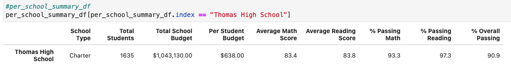
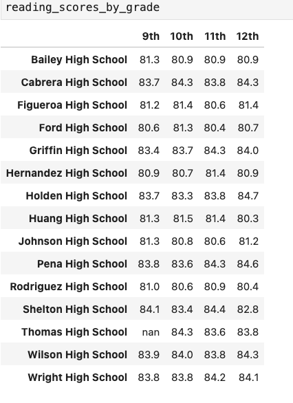

# **Module4-School_District_Analysis**
# **Module 4 PyCitySchools with Pandas / Python**

## **Project Overview**

### The purpose of this analysis is to investigate suspected academic dishonesty; specifically, reading and math grades for Thomas High School ninth graders appear to have been altered.  The task is to replace the inaccurate data for the 9th graders at Thomas High School while keeping the rest of the data intact and perform the same analysis we did in our module.

### The steps to to conduct this analysis are as follows:

###     1. Replace the math and reading scores for Thomas High School with NaNs while keeping the rest of the data intact.
###     2. Repeat the school district analysis and recreate the following metrics:
####       - The district summary
####       - The school summary
####       - The top 5 and bottom 5 performing schools, based on the overall passing rate
####       - The average math score for each grade level from each school
####       - The average reading score for each grade level from each school
####       - The scores by school spending per student, by school size, and by school type.
###     3. Describe how these changes affect the overall analysis.

## **Results**

### **The Python codes that were used in this project:**
### [PyCitySchools_Challenge](https://github.com/davidzachie/Module4-School_District_Analysis/blob/main/PyCitySchools_Challenge.ipynb)

### **How is the district summary affected?**

 

 

#### The district summary was barely affected by the correction made:
#### - The average Math Score decreased by 0.1 point to 78.9.
#### - The % Passing Math decreased by 0.2% to 74.8%.
#### - The average Reading Score did not change.
#### - The % Passing Reading decreased by 0.1% to 85.7%.
#### - The % Overall Passing decreased by 0.3% to 64.9%.

### **How is the school summary affected?**

 

#### The school summary was slightly affected by the correction made:
#### - The average Math Score did not change.
#### - The % Passing Math decreased by 0.1% to 93.2%.
#### - The average Reading Score increased by 0.1 point to 83.9.
#### - The % Passing Reading decreased by 0.3% to 97.0%.
#### - The % Overall Passing decreased by 0.3% to 90.6%.

### **How does replacing the ninth graders’ math and reading scores affect Thomas High School’s performance relative to the other schools?**

 

#### Thomas High School’s performance relative to the other schools was not affected by the correction as shown by the 5 highest and 5 lowest performing schools ranking in the district.

### **How does replacing the ninth-grade scores affect the following:**

#### - Math and reading scores by grade

#### The average math and reading scores for Thomas High School ninth graders show as NaN on the math and reading scores by grade summary.

#### - Scores by school spending

#### The only changes are on the $630-644 range where the % Passing Reading and the % Overall Passing both dropped by 0.1% to respectively 84.3% and 62.8%.

#### - Scores by school size

#### The only change is on the Medium size school range where the % Passing Reading dropped by 0.1% to 96.7%.

#### - Scores by school type

#### There is change to the scores by school type summary after correction.

## **Summary**

#### The four major changes that occurred is the number of total students, the number of students counted at Thomas High School, the average math and reading scores, and the overall percentages for math and reading at Thomas High School. The removal of data implies a decrease in the count of total students overall, and total students at Thomas High School, specifically for this analysis. And since the population amount was decreased, this leads to a change in average scores and score percentages. Due to the fact that these score and percentage changes were minimal, we can assume that the removal of math and reading scores of 9th graders at Thomas High School not as significant as we would imagine it to be.

#### Replacing the math and reading scores did not create major changes to the school district analysis.
#### The Scores by Grade Summary for Thomas High School changed and displays NaN values for its ninth-grade's math and reading scores.
#### The following metrics were slightly affected by the correction: the district summary, the school summary for Thomas High School, the scores by school spending and the scores by school size summaries.
